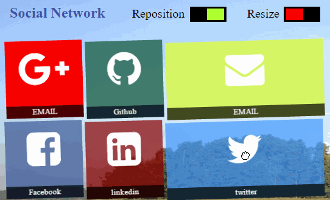
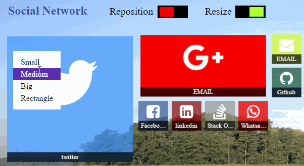
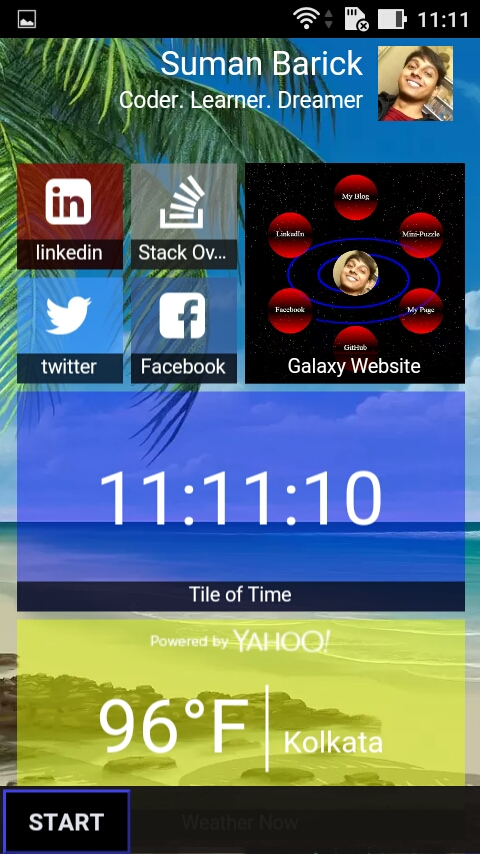

# barick-tilefy
A Windows 8.1 Metro Style Responsive Web Plugin 

[**Please Note: It is currently Responsive on Page load/Reload i.e. Any change in viewport width needs the page to be refreshed**]


## Table of contents

* [Quick Highlight](#quick-highlight)
* [Demos and Samples](#demos-and-samples)
* [Dependencies](#dependencies)
* [Get Started](#get-started)
* [Different Types of Tiles](#different-types-of-tiles)
* [Contacts](#contacts)
* [Showcase Your Website](#showcase-your-website)
* [Support This Development](#support-this-development)
* [Copyright and license](#copyright-and-license)


## Quick Highlight

#### Drag to Move / Reposition Tiles


#### Resize Tiles [4 sizes - Small, Medium, Big, Rectangle]


#### Responsive on Page Load - Mobile Screenshot



## Demos and Samples
* [Vertical Scrollable Tiles Demo - Responsive on Reload](http://barick.in)
* [Horizontally Scrollable Grouped Tiles Demo - Not Responsive](http://codotronix.github.io/barick-tilefy/samples/horizontal-scroll-demo/)


## Dependencies
"barick-tilefy" needs the following to work,
* [jquery](https://jquery.com/)
* [hand.js](https://handjs.codeplex.com/)
* [animate.css](https://daneden.github.io/animate.css/)
* [font awesome - (optional) - if you use their icons](http://fontawesome.io/)


## Get Started

* **Include Tilefy js and css files** <br/>
  Put these two lines in the `<head>` section of your page

```
  1. <link rel="stylesheet" href="css/barick-tilify.min.css" />
  2. <script src="js/barick-tilefy.min.js"></script>

```

* **Make the "Tile Descriptor" (TD)**<br/>

  A TD is a `json` object which has 2 properties,
  1. `tileOrder` - An array of tile IDs in the order you want them to be pickd up while being drawn on screen
  2. `tiles` - An object containing all tile objects as value corresponding to their unique IDs as key.
  
  So, a simple "Tile Descriptor" (TD) containing 3 tiles will simply look like,
```
{
  "tileOrder": ["id1", "id3", "id2"],
    
  "tiles": {
        "id1": {
            "id": "id1",
            "name": "Learn",
            "size": "medium",
            "contentType": "font",
            "icon": "fa fa-graduation-cap",
            "bgColor":"rgba(59, 89, 152, 0.7)"
        },
        "id2": {
            "id": "id2",
            "name": "Friends",
            "size": "small",
            "contentType": "font",
            "icon": "fa fa-users",
            "bgColor": "rgba(139, 120, 0, 0.7)"
        },
        "id3": {
            "id": "id3",
            "name": "Movies",
            "size": "rectangle",
            "contentType": "font",
            "icon": "fa fa-film",
            "bgColor": "rgba(142, 40, 140, 0.69)"
        }
  }
}

```


* **Make a "config" Object** <br/>
  A "config" object contains various configuration options, regarding various operations on tile. A sample "config" object would be like this

```
  var config = {};
  config.TD = TD;                                               // MANDATORY
  config.btn_ID_to_Toggle_Tile_Movement = 'Your-HTML-Elem-ID';  //OPTIONAL
  config.btn_ID_to_Toggle_Tile_Resize = 'Another-HTML-Elem-ID'; //OPTIONAL
  config.gridCapacityPerRow = ANY_NUMBER;                       //OPTIONAL
```

  1. `config.TD`: (Mandatory) This is the Tile Descriptor object we just made in the previous step.
  2. `config.btn_ID_to_Toggle_Tile_Movement`: (Optional) Provide the ID of the html element which you want user to use to toggle Tile Movement / Reposition functionality ON and OFF.
  3. `config.btn_ID_to_Toggle_Tile_Resize`: (Optional) Same as no. 2 but for Tile Resize functionality.
  4. `config.gridCapacityPerRow`: (Optional) This is a powerful configuration option. By this you can define the total number of grids (Small Tile) that can be placed in a row. The more the number the smaller will the size of tiles will be.
  *[Remember 1 grid = 1 Small Tile. So, Medium Tiles are 2x2 i.e 4 grids are required to place a small tile. Big Tiles are 4 grids wide and 4 grids high, so 4x4=16 grids are required to place a Big Tile.]*


* **Finally, Call "tilefy()"** <br/>
Now that we are done with the configuration, here's the Final Step. Grab the ID of the DIV container where you want to show your tiles and call "tilefy" on it.

```
$('#ID_of_Your_Container_Div').tilefy(config);
```


## Different Types of Tiles
  There are different types of tiles that you might want to show in your page and all of those can be congigured in your TD (Tile Descriptor).
  1. Static Tile with an Icon at its center
  2. Static Tile that shows only 1 Image
  3. Static Tile that shows only A Fixed Text
  4. Live Tile that shows Multiple images
  5. Live Tile that shows Multiple Texts
  6. Live Tile that shows Multiple Texts and Images
  7. Live Tile that is Entirely An Application (Plugin) itself with Infinite Possibilities
  
We achieve different tile types by changing the `contentType` property when we define a file. And possible values for `contentType` can be `font, live and plugin`

* **Static Tile with an Icon at its center**

_"contentType": "font"_

Now, to achieve *Tile Type 1*, we can define the tile like this, say we define a "Twitter Tile"

```
"twitter": {
                "id": "twitter",          // THIS ID and This JSON's objects key should always be same, for all kind of tiles
                "name": "twitter",        // A name to show users
                "size": "small",          // can be Small / Medium / Big / Rectangle
                "contentType": "font",    // This is IMPORTANT, it defines the Type of Tile it is going to be
                "icon": "fa fa-twitter",  // The Font Awesome Icon Class to be displayed
                "bgColor": "rgba(64, 153, 255, 0.7)",       // The Background Color of the Tile
                "link": "https://twitter.com/codotronix"    // Link to your Twitter
            }
```
   
  <br/> 
   
  * **Static Tile that shows only 1 Image**
  * **Static Tile that shows only A Fixed Text**
  * **Live Tile that shows Multiple images**
  * **Live Tile that shows Multiple Texts**
  * **Live Tile that shows Multiple Texts and Images**
  

    _"contentType": "live"_


For tile type 2 to 6, the `contentType` should be `live`. Let's see it with an example of, say, "myPictures" tile definition (see comments below),
```
"myPictures": {
                "id": "myPictures",
                "name": "My Pictures",
                "size": "big",
                "contentType": "live",
                "liveImgUrls": ["img/myPictures/1.jpg", "img/myPictures/3.jpg", "img/myPictures/4.jpg"],  //Optional, 1 image for fixed tile, more than 1 image for live image tile
                "liveTxts": ["Welcome to my Website", "Follow me at Twitter @codotronix"],                //Optional, if array size 1, then fixed, if array size > 1, then texts will be changing in certain interval
                "fontColor": "ivory",
                "bgColor": "rgba(255,255,255,.2)"
```
    
So, the idea is, if the `contentType` is `live`, then if `liveImgUrls` array contains 1 element then the tile will show only that image, but if the array size > 1, then they will be shown one by one. Same goes for the `liveTxts` array. Omit any of `liveImgUrls` or `liveTxts` array to make the tile of live text type or live image type accordingly.

<br/>


* **Live Tile that is Entirely An Application (Plugin) itself with Infinite Possibilities**

  _"contentType": "plugin"_

This is the ultimate powerful tile type and its limit is only your imagination. You can build any _html/css/js_ application and put it inside this tile. Just follow these steps,
    
  1. Inside the `tile_plugins` folder make a folder for your plugin
  2. The folder name should be same as the tileId in your tile definition
  3. Inside that folder should be a file called `index.js`
  4. In this `index.js` file you build up your HTML, bind them with js, style them with CSS
  5. When done making the HTML, put everything inside element `$('#yourTileID .plugin')`
  6. Done... See [tileOfTime](https://github.com/codotronix/barick-tilefy/blob/master/tile_plugins\tileOfTime) and/or [weatherNow](https://github.com/codotronix/barick-tilefy/blob/master/tile_plugins\weatherNow) for example plugin type tile.
  


<br/>

## Showcase Your Website
I would love to see how you are using this plugin. So, if you build something cool using this plugin and don't mind showing it off to the world, just contact me know in any of the following ways and I will showcase your site in my site.


## Support This Development
Lots of Time and Love has been put into this development. It is still in baby stage and still has a long way to go. So, your support in any way will be a huge help and motivation
  * Put a line or two on facebook, twitter or your blog
  * Put a link on your website
  * Tell your friends to use it
  * Or if you really can't stop yourself from making a donation, my paypal id is barick9@gmail.com


## Contacts:
* [Twitter](https://twitter.com/codotronix)
* [Facebook](https://www.facebook.com/codotronix)
* [LinkedIn](https://www.linkedin.com/in/sumanbarick)


## Copyright and License
Code and documentation copyright 2016 Suman Barick. Code released under [the MIT license](https://github.com/codotronix/barick-tilefy/blob/master/LICENSE)
