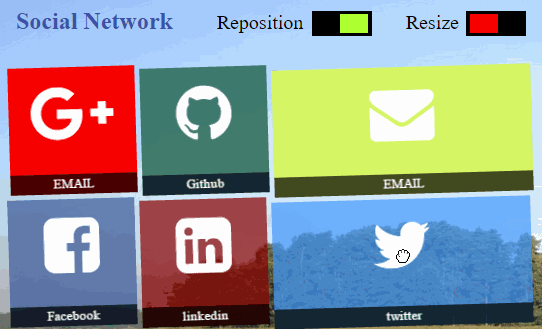
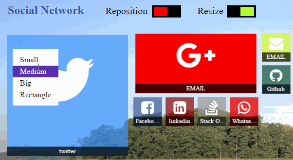

# barick-tilefy
A Windows 8.1 Metro Style Responsive Web Plugin

## Table of contents

* [Features Highlight](#features-highlight)
* [Demos and Samples](#demos-and-samples)
* [Dependencies](#dependencies)
* [How To Use](#how-to-use)
* [Contacts](#contacts)
* [Showcase Your Website](#showcase-your-website)
* [Copyright and license](#copyright-and-license)

## Features Highlight

#### Drag to Move / Reposition Tiles

#### Resize Tiles [4 sizes]

## Demos and Samples
* [Vertical Scrollable Tiles Demo](http://barick.in)
* [Horizontally Scrollable Grouped Tiles Demo](http://codotronix.github.io/barick-tilefy/samples/horizontal-scroll-demo/)

## Dependencies
"barick-tilefy" needs the following to work,
* [jquery](https://jquery.com/)
* [hand.js](https://handjs.codeplex.com/)

## How To Use
Coming soon...

## Showcase Your Website
I would love to see how you are using this plugin. So, if you build something cool using this plugin and don't mind showing it off to the world, just contact me know in any of the following ways and I will showcase your site in my site.

## Contacts:
* [Twitter](https://twitter.com/codotronix)
* [Facebook](https://www.facebook.com/codotronix)
* [LinkedIn](https://www.linkedin.com/in/sumanbarick)

## Copyright and License
Code and documentation copyright 2016 Suman Barick. Code released under [the MIT license](https://github.com/codotronix/barick-tilefy/blob/master/LICENSE)
